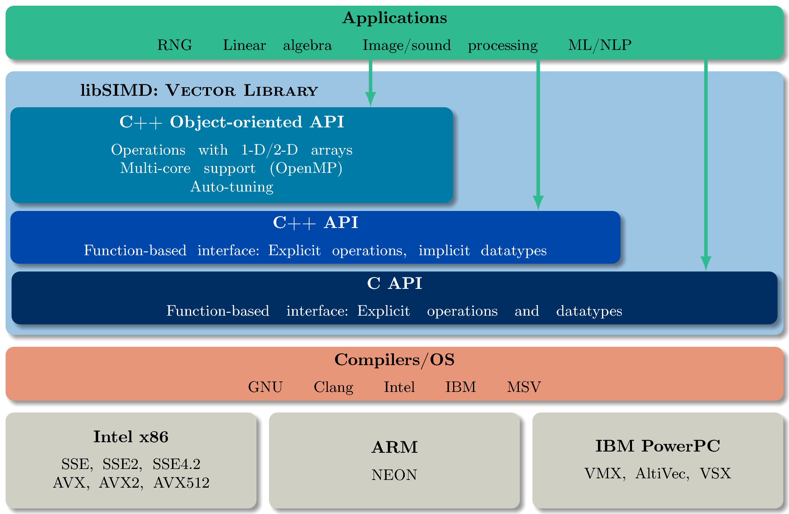

# GVL - Generic Vector Library

High-performance processors are ubiquitous in current computing systems
and have wide vector units.
The common approach for programming these is via high-level languages,
such as C and C++, and letting compilers automatically vectorize.
While compilers have been very successful at analyzing vectorization
opportunities, in certain circumstances the programmer wants to tune the code
explicitly.
Moreover, vector instructions vary between processor vendors and compilers.

The *Generic Vector Library (GVL)* provides a common C and C++ API for explicit
vectorization, agnostic from processor and compiler.
The code written using GVL can run with/without vectorization, thus preventing
the development of multiple variants of source code and allowing performance
comparisons.
GVL library consists of several layers:
- C functions API
- C++ function API
- C++ object oriented (and templates) APIs
- Multi-core dispatcher using OpenMP

GVL vector instruction sets supported are:
- Intel SIMD intrinsics

## General requirements:

GNU compilers, require 4.8 or greater for `__builtin_cpu_supports()`
    C++98 - function overloading
    _POSIX_C_SOURCE>=200112L
    _ISOC99_SOURCE

## SIMD requirements:

- SSE
    - At least SSE2 `_mm_shuffle_epi32()` and `_mm_or_epi32()`
    - At least SSE4.1 for `_mm_mullo_epi32()` and `_mm_mul_epi32()`
- AVX
    - At least AVX2 for integer instructions, `_mm256_mullo_epi32()`,
      `_mm256_mul_epi32()`, and others

## Additional details

All SIMD macro decisions are ordered from most recent technology to oldest.
This allows the use of best available technology without the user having to
specify.
Note that the user is allowed to decide on a specific technology using a macro
definition.
The number of streams depends on the width of the vector unit.

Arrays of SIMD intrinsics are allocated using `posix_memalign()`,
using fixed arrays worked for SSE but not AVX.
It seems this is due to compiler (GCC) not providing automatic
support for large vector datatypes.

## General issues with automatic parallelism

1. Data dependencies
1. Data races
